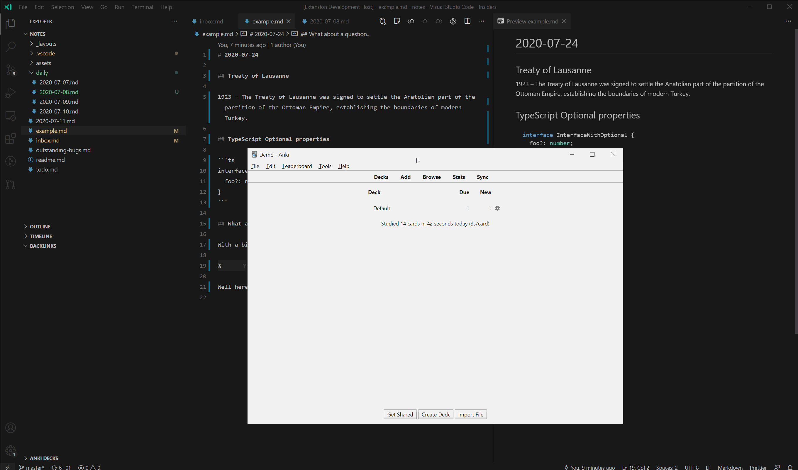
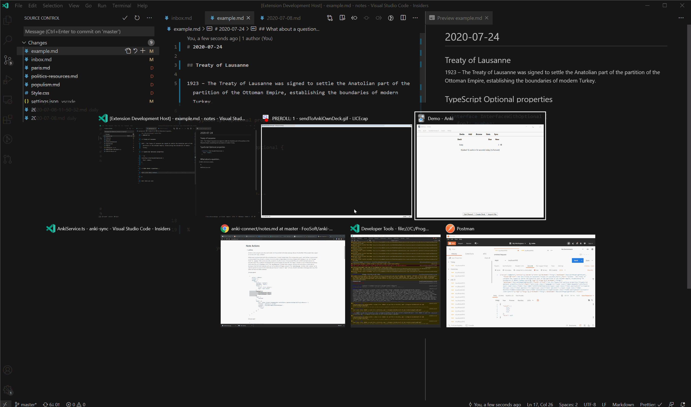

# Anki for VSCode FORK

I have forked extension to use the original author's nice groundwork to expand this for use with [Foam](https://foambubble.github.io/foam/). My vision is a tighter coupling between an Anki deck which is semi-automatically synchronized with the Foam directory.

## Changes so far

- Added command: "Anki: Send All" Send all the .md files in your (1st) workspace to Anki.
- Fixed(?) Transformer.transform() to use constructor source instead of active text document.
- Transformer & Serializer now take MarkdownFile objects
- Serializer can now handle media with relative file paths.
- Added option: "anki.md.card.strategy" with "Nested Headers" & "Delimiter"; Delimiter is original author strategy. See Nested Headers below
- Added option: "anki.send.allowUpdates". If enabled, this will check the anki db for cards where the front matches the sent card. Then, if the rest of the fields are not a match, it will delete the card from the anki db and replace it with the sent card. This will allow you continuously edit the markdown files and have it reflected in anki. This will of course, remove any learning state from the card, which is my current intended behavior. Beware: If you edit a card from within Anki, these changes will trigger a delete as it will no longer match the markdown.

## Todo:

- Update Anki on .md save option.
- Better feedback for what happened during Send to Anki (# cards created, # unchanged, etc)
- System to designate files/dirs for exclusion/inclusion on Send All
- Add option so that card updates are in place, leaving the learning meta data.

## Known Issues

- What should SendAll do if multiple workspaces? 
- At the moment, Nested header strategy ignores clozes, % sign and tags. I don't use any of this, so I am in no rush to add it.
- Nested Header strategy ignores original author's use of title to send to own deck.
- Card updates from within Anki are overwritten. Is there a solution...? There doesn't seem to be any way to know if the card was updated in Markdown or Anki last and which should take priority.


## Nested Headers

This is a strategy to create cards from markdown. The way it works is the header #, ##, ###, etc delimit cards. Each block of html between headers becomes the back of a card.
The front of the cards is the tree of headers to the card. This allows you to create cards like so:

axillary-neuropraxia.md:

      # Axillary Neuropraxia

      see [[Neuropaxia]]

      ## Etiology

      - Shoulder dislocation
      - Masses

      ## Findings

      ### MRI findings

      Atrophy of teres minor muscle, inferior deltoid

       

      ## Associated Lesion

      [[GAGL]] from shoulder dislocation

Text appearance of created cards (In reality they have the HTML styling from the markdown parser):

    Axillary Neuropraxia
    ---
    see [[Neuropaxia]]

    
    Axillary Neuropraxia
    Etiology
    ---
    * Shoulder dislocation 
    * Masses

    
    Axillary Neuropraxia
    Findings
    MRI findings
    ---
    Atrophy of teres minor muscle, inferior deltoid 
    img img***

    
    Axillary Neuropraxia
    Associated Lesion
    ---
    [GAGL] from shoulder dislocation

*** Media & html is sent to and rendered in Anki appropriately like the original plugin.

I recommend you update the card style sheet within Anki to adjust the headers, in particular to make h1 smaller. I just added the line  `h1 { font-size: 20px }` to mine.


# Original Readme below:


[](https://marketplace.visualstudio.com/items?itemName=jasew.anki)

This is a VSCode extension for interacting and sending cards to Anki.  
It uses AnkiConnect for communication so you will need this extension installed and running before installing the VSCode extension.

## Requirements

- Anki >= 2.1.21
- [Anki Connect](https://ankiweb.net/shared/info/2055492159) >= 2020-07-13
- VSCode >= 1.47

## Features

### Send to deck

If you're writing up Markdown files and want to send some Q & As to a deck you can do that quite easily with the `Anki: Send To Deck` command.  
It will send to this extension's default deck named "notes" but you can change this in the settings.  
This is useful if you want a "Daily" deck where you can put daily notes into.
This extension will also add a tag to each card based on the title, so you can still organise cards within a deck.

Here's an example



### Send to own deck

Very similar to the above but will send to a new deck that will have the same name that you marked with `#` as the title of the current document.  
In this example we realise that we want to send this content to its own deck, that's no problem, use `Anki: Send To Own Deck`

Here's an example



### Explorer

Navigate through cards and template CSS.  
Currently this is in a readonly state but future releases should enable editing.


## Cards

By default, Anki for VSCode splits cards by `##` headline. For example, below markdown will generate 2 cards where headlines will be on the front side and its description - on the back.

```
## What's the Markdown?

Markdown is a lightweight markup language with plain-text-formatting syntax.
Its design allows it to be converted to many output formats,
but the original tool by the same name only supports HTML.

## Who created Markdown?

John Gruber created the Markdown language in 2004 in collaboration with
Aaron Swartz on the syntax.

```

If you want to have multiple lines on the card's front side - use `%` symbol for splitting front and back sides:

```
## YAGNI

Describe this acronym and why it's so important.

%

"You aren't gonna need it" (YAGNI) is a principle of extreme programming
(XP) that states a programmer should not add functionality until deemed
necessary.

```

When parsing only one markdown file, the title of the deck could be generated based on the top-level headline (`#`).

### Cloze

You can make Cloze deletions in the card title `## A bit like {{c1::this}}`.
Any body attached to a Cloze title won't be used. This is because by default, Cloze card's only have 1 side.

Cloze cards won't work when using `%` also, this is due to the way Cloze cards work (We can't enforce any styling).

### Images

You can add images to Anki by adding them to your markdown file:

```

```

## Tags

Cards can have tags in their markdown sources. For adding tags to cards it should follow some rules:

- tags start from a new line
- only one line with tags per card
- a tag should be written in the link format
- tag (link text) should start from `#` symbol

uses `'^\\[#(.*)\\]'` pattern for searching tags. This pattern could be overwritten by specifying custom settings. The source file in the tag link is optional.

The below example will generate a card with 3 tags: _algorithms_, _OOP_, and _binary_tree_.

```
## Binary tree

In computer science, a binary tree is a tree data structure in which each node has at most two children, which are referred to as the left child and the right child.

[#algorithms](./algorityms.md) [#OOP]() [#binary tree]()
```

## Code and syntax highlighting

Syntax highlighting should work out the box.
Code blocks can be written with and without specifying a language name:

<pre>
```java
public static void main(String[] args) {
  System.out.println("Hello, World!");
}
```
</pre>
<pre>
```
echo "Hello, World!"
```
</pre>

## Extension Commands

- `Anki: Sync Anki`: This will run Sync on your Anki Instance
- `Anki: Anki: Send To Deck`: This will attempt to send your (markdown) card into Anki - More info above
- `Anki: Anki: Send To Own Deck`: Sends to a new deck using the Markdown's title (# example) as a deck name
- `Anki: Force Re-install`: This will attempt to re-setup the extension on Anki (Anki needs to be running). You shouldn't need this unless there's an issue.

## Extension Settings

- `anki.defaultDeck`: Default deck to send notes to. | _notes_
- `anki.md.createTagForTitle`: Send tag with cards? (when using default deck). | _true_
- `anki.api.hostname`: API Hostname. | _127.0.0.1_
- `anki.api.port`: API Port. | _8765_
- `anki.api.schema`: Schema. | _http_

I don't recommend messing with the following settings

- `anki.md.card.separator`: Regex used for separating cards
- `anki.md.card.frontBackSeparator`: Regex used for separating front / back
- `anki.md.card.tagPattern`: Regex used to scrape tags
- `anki.md.deck.titleSeparator`: Regex to remove the top title from cards
