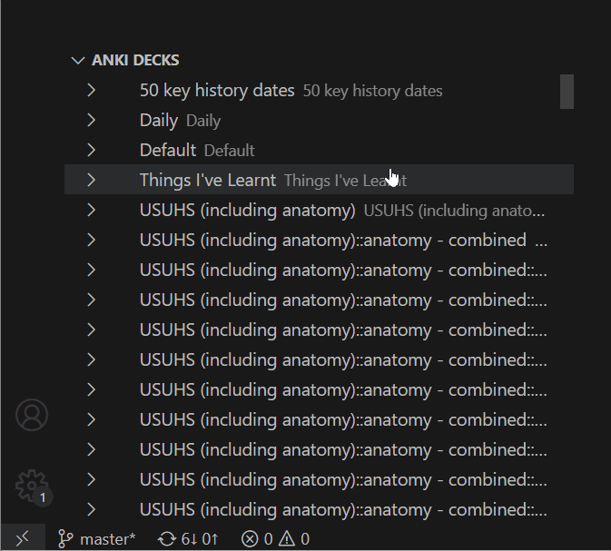

# Anki for VSCode (Beta)

This is a VSCode plugin for interacting and sending cards to Anki.  
It uses AnkiConnect for communication so you will need this plugin installed and running before installing the VSCode extension.

## Features

### Send to deck

If you're writing up Markdown files and want to send some Q & As to a deck you can do that quite easily with the `Anki: Send To Deck` command.  
It will send to the default deck "notes" but you can change this in the settings.  
This is useful if you want a "Daily" deck where you can put daily notes into.
This plugin will also add a tag to each card based of the title, so you can still organise cards within a deck.

Here's an example

### Send to own deck

Very similar to the above but will send to a new deck of the Markdown title.  
In this example we realise that we want to send this content to its own deck, that's no problem, use `Anki: Send To Own Deck`

Here's an example

### Explorer

More to come on this

## Requirements

- Anki >= 2.1.21
- [Anki Connect](https://ankiweb.net/shared/info/2055492159) >= 2020-07-13
- VSCode >= 1.47

## Extension Settings

- `anki.defaultDeck`: Default deck to send notes to. | _notes_
- `anki.md.createTagForTitle`: Send tag with cards? (when using default deck). | _true_
- `anki.api.hostname`: API Hostname. | _127.0.0.1_
- `anki.api.port`: API Port. | _8765_
- `anki.api.schema`: Schema. | _http_
- `anki.api.port`: API Port. | _8765_

I don't recommend messing with the following settings

- `anki.md.card.separator`: Regex used for separating cards
- `anki.md.card.frontBackSeparator`: Regex used for separating front / back
- `anki.md.card.tagPattern`: Regex used to scrape tags
- `anki.md.deck.titleSeparator`: Regex to remove the top title from cards
